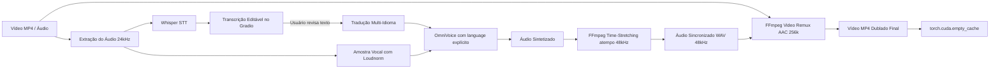

# 🎙️ Matraca Studio — Dublador & Clonador de Voz

[](https://colab.research.google.com/github/dgurgel-info/ai-colab-matracastudio/blob/main/Matraca_Studio.ipynb)


> **Duble qualquer vídeo MP4 ou áudio clonando a sua própria voz e mantendo exatamente o mesmo tempo de duração do conteúdo original!**

O **Matraca Studio** é uma suíte completa de localização e dublagem de vídeo e áudio potencializada por Inteligência Artificial. Com ele, você envia uma gravação, o sistema transcreve o conteúdo, traduz para o idioma desejado, clona a sua voz e sincroniza milimetricamente o áudio traduzido com a duração do vídeo original, exportando o novo vídeo pronto e em alta definição.

---

## ✨ Principais Funcionalidades

- 🎥 **Entrada Universal de Mídia**: Suporte para vídeos (`.mp4`, `.mov`, `.mkv`, `.avi`), faixas de áudio (`.wav`, `.mp3`, `.m4a`) ou gravação direta pelo microfone.
- 🗣️ **Reconhecimento Preciso e Transcrição Editável**: Transcrição automática com Whisper e detecção do idioma de origem. Permite **revisar e ajustar palavras, pontuações ou nomes próprios** antes de iniciar a dublagem.
- 🌍 **Dublagem Multi-Idioma em Lote (Checkboxes)**: Permite selecionar múltiplos idiomas de destino simultâneos (Inglês, Espanhol, Francês, Alemão, etc.). Cada idioma é traduzido e sintetizado no idioma correto de forma estrita e sequencial.
- 🧬 **Clonagem de Voz Zero-Shot de Alta Fidelidade (OmniVoice)**: Extração acústica pura e alinhada com Whisper, preservando o timbre natural, entonação e características vocais únicas de quem falou em cada idioma de destino.
- ⏱️ **Linha do Tempo Inteligente (Preservação de Música de Introdução/Encerramento)**: Se o arquivo contiver música ou vinheta de abertura antes da fala (ex: de 0.0s a 5.0s), essa trilha é **preservada integralmente**. A voz clonada dublada entra **no segundo exato onde a pessoa começa a falar**, e encerra mantendo eventuais músicas finais intactas até a duração exata do arquivo original.
- 🧹 **Gestão Eficiente de GPU**: Liberação imediata de VRAM com `torch.cuda.empty_cache()` após cada idioma, prevenindo estouro de memória (*CUDA Out Of Memory*) na GPU T4.
- 🎬 **Remuxing Instantâneo de Vídeo**: Substituição direta da trilha de áudio no vídeo original usando cópia de stream (`-c:v copy`), sem perda de qualidade visual e renderização em segundos.
- 📥 **Download Individual dos Arquivos Gerados**: Download individual direto de cada arquivo gerado (vídeos MP4 dublados e áudios WAV identificados por idioma), além de tabela completa com métricas de sincronização e transcrições geradas.
- ✍️ **Aba de Clonagem Livre (TTS)**: Permite sintetizar qualquer texto digitado com a sua voz clonada.

---

## 🌐 Idiomas em Destaque

| Idioma | Código | Suporte |
| :--- | :---: | :---: |
| 🇧🇷 **Português do Brasil (pt-BR)** | `pt-BR` | Transcrição, Tradução e Clonagem |
| 🇺🇸 **Inglês (English)** | `en` | Transcrição, Tradução e Clonagem |
| 🇪🇸 **Espanhol (Español)** | `es` | Transcrição, Tradução e Clonagem |
| 🇫🇷 **Francês (Français)** | `fr` | Transcrição, Tradução e Clonagem |
| 🇩🇪 **Alemão (Deutsch)** | `de` | Transcrição, Tradução e Clonagem |
| 🇨🇳 **Chinês Simplificado (中文)** | `zh-CN` | Transcrição, Tradução e Clonagem |
| 🇸🇦 **Árabe (العربية)** | `ar` | Transcrição, Tradução e Clonagem |
| 🇮🇹 **Italiano (Italiano)** | `it` | Transcrição, Tradução e Clonagem |
| 🇯🇵 **Japonês (日本語)** | `ja` | Transcrição, Tradução e Clonagem |
| 🇷🇺 **Russo (Русский)** | `ru` | Transcrição, Tradução e Clonagem |

---

## 🔄 Fluxo de Processamento (Pipeline)



---

## 🚀 Como Executar no Google Colab

1. Abra o notebook diretamente no Google Colab clicando no badge abaixo:  
   [](https://colab.research.google.com/github/danieldemoraisgurgel/matracastudio/blob/main/Matraca_Studio.ipynb)
2. Ative a aceleração por GPU:
   - No menu superior, clique em **Ambiente de Execução** (*Runtime*) ➔ **Alterar tipo de ambiente de execução** (*Change runtime type*).
   - Selecione **T4 GPU** e salve.
3. Execute as células sequencialmente:
   - **Passo 1:** Instala as dependências e o FFmpeg.
   - **Passo 2:** Carrega o Whisper e o OmniVoice na VRAM da GPU.
   - **Passo 3:** Compila o motor de sincronização temporal e tradução robusta.
   - **Passo 4:** Inicia a aplicação Gradio e gera o link público compartilhavel (`https://...gradio.live`).
4. **Utilizando a Interface:**
   - Envie seu vídeo ou áudio.
   - Clique em **📝 1. Transcrever e Analisar Áudio Original**.
   - Leia e ajuste qualquer palavra na caixa de transcrição caso necessário.
   - Marque os idiomas de destino desejados (**Inglês, Espanhol**, etc.).
   - Clique em **✨ 2. Dublar e Sincronizar Vídeo/Áudio**.
   - Acompanhe a barra de progresso em tempo real e faça o download dos arquivos em alta definição!

---

## 📁 Estrutura do Projeto

```text
matracastudio/
├── Matraca_Studio.ipynb      # Notebook completo com backend e interface Gradio
├── README.md                 # Documentação oficial do projeto
├── LICENSE                   # Licença MIT
└── .gitignore                # Arquivos e extensões ignoradas no versionamento
```

---

## 📄 Licença

Este projeto é distribuído sob a licença **MIT**. Consulte o arquivo [LICENSE](LICENSE) para obter mais informações.
