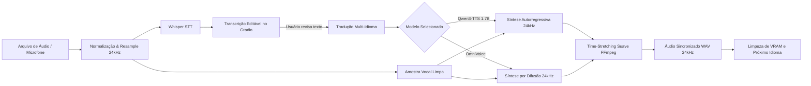

# 🎙️ Matraca Studio — Dublador & Clonador de Voz

[](https://colab.research.google.com/github/dgurgel-info/ai-colab-matracastudio/blob/main/Matraca_Studio.ipynb)


> **Duble qualquer áudio clonando a sua própria voz mantendo o tempo exato e com suporte a sincronização por legendas SRT!**

O **Matraca Studio** é uma suíte completa de localização e dublagem de áudio potencializada por Inteligência Artificial. Com ele, você envia um arquivo de áudio (WAV, MP3, M4A, etc.), o sistema transcreve o conteúdo, traduz para o idioma desejado, clona a sua voz utilizando **Qwen3-TTS 1.7B** ou **OmniVoice** e sincroniza milimetricamente o áudio traduzido com a duração do áudio original ou guia a locução por legendas `.SRT`!

---

## ✨ Principais Funcionalidades

- 🎙️ **Entrada Otimizada de Áudio**: Suporte exclusivo para áudios (`.wav`, `.mp3`, `.m4a`, `.ogg`, `.flac`) ou gravação direta pelo microfone.
- 🗣️ **Reconhecimento Preciso e Transcrição Editável**: Transcrição automática com Whisper e detecção do idioma de origem. Permite **revisar e ajustar palavras, pontuações ou nomes próprios** antes de iniciar a dublagem.
- 🧠 **Seleção de Motores de IA de Ponta**:
  - ⚡ **Qwen3-TTS 1.7B Base** (*Alibaba Cloud*): Modelo autorregressivo de 1.7B parâmetros com altíssima expressividade, entonação realista e prosódia humana.
  - 🎙️ **OmniVoice** (*k2-fsa*): Modelo leve e rápido de difusão acústica.
- 🌍 **Dublagem Multi-Idioma Dinâmica**: Permite selecionar múltiplos idiomas de destino. A interface adapta as opções automaticamente de acordo com o modelo selecionado (no Qwen3-TTS, o Árabe não fica selecionável por não possuir suporte nativo; no OmniVoice, todos os 10 idiomas estão liberados).
- ⏱️ **Linha do Tempo Inteligente**: Preservação automática de introdução e encerramento originais com ajuste fino de tempo (*time-stretching* suave).
- 🎬 **Clonagem Guiada por Legendas SRT**: Importe arquivos `.SRT` com marcação de tempo para que a fala sintetizada respeite rigorosamente as janelas temporais e as pausas entre cada fala.
- 🌓 **Modo Claro / Escuro (Dark Mode)**: Alternância de tema com persistência local no navegador.
- 🧹 **Gestão Estrita de VRAM e Processamento 100% Sequencial**:
  - **Apenas 1 modelo ativo por vez na GPU**: Ao alternar entre Qwen3-TTS e OmniVoice, o modelo anterior é descarregado da memória antes do novo carregar.
  - **Processamento estritamente sequencial (1 idioma por vez)**: Nunca executa gerações simultâneas, realizando limpeza contínua de cache a cada bloco sintetizado e após cada idioma.
- 📥 **Download Individual e Prévias em Tempo Real**: Players embutidos de áudio com download imediato dos arquivos gerados (WAVs).
- ✍️ **Aba de Clonagem Livre (TTS & SRT)**: Sintetize qualquer texto digitado ou arquivos de legenda com a sua voz clonada escolhendo entre Qwen3-TTS 1.7B e OmniVoice.

---

## 🌐 Idiomas Suportados

| Idioma | Código | Qwen3-TTS 1.7B | OmniVoice |
| :--- | :---: | :---: | :---: |
| 🇧🇷 **Português do Brasil (pt-BR)** | `pt-BR` | ✅ Nativo | ✅ Nativo |
| 🇺🇸 **Inglês (English)** | `en` | ✅ Nativo | ✅ Nativo |
| 🇪🇸 **Espanhol (Español)** | `es` | ✅ Nativo | ✅ Nativo |
| 🇫🇷 **Francês (Français)** | `fr` | ✅ Nativo | ✅ Nativo |
| 🇩🇪 **Alemão (Deutsch)** | `de` | ✅ Nativo | ✅ Nativo |
| 🇨🇳 **Chinês Simplificado (中文)** | `zh-CN` | ✅ Nativo | ✅ Nativo |
| 🇮🇹 **Italiano (Italiano)** | `it` | ✅ Nativo | ✅ Nativo |
| 🇯🇵 **Japonês (日本語)** | `ja` | ✅ Nativo | ✅ Nativo |
| 🇷🇺 **Russo (Русский)** | `ru` | ✅ Nativo | ✅ Nativo |
| 🇸🇦 **Árabe (العربية)** | `ar` | ❌ Não suportado *(desmarcado)* | ✅ Suportado |

---

## 🔄 Fluxo de Processamento (Pipeline)



---

## 🚀 Como Executar no Google Colab

1. Abra o notebook diretamente no Google Colab clicando no badge abaixo:  
   [](https://colab.research.google.com/github/dgurgel-info/ai-colab-matracastudio/blob/main/Matraca_Studio.ipynb)
2. Ative a aceleração por GPU:
   - No menu superior, clique em **Ambiente de Execução** (*Runtime*) ➔ **Alterar tipo de ambiente de execução** (*Change runtime type*).
   - Selecione **T4 GPU** e salve.
3. Execute as células sequencialmente:
   - **Passo 1:** Instala as dependências (Qwen3-TTS, OmniVoice, Whisper, Gradio) e o FFmpeg.
   - **Passo 2:** Carrega o Whisper e inicializa o motor de TTS na VRAM da GPU (1 modelo por vez na memória).
   - **Passo 3:** Compila o motor de sincronização temporal, suporte a SRT, tradução robusta e síntese sequencial.
   - **Passo 4:** Inicia a aplicação Gradio e gera o link público compartilhável (`https://...gradio.live`).
4. **Utilizando a Interface:**
   - Envie seu arquivo de áudio (WAV, MP3, M4A, etc.) ou grave pelo microfone.
   - Escolha o modelo de IA desejado (**Qwen3-TTS 1.7B** para alta expressividade ou **OmniVoice** para leveza e suporte ao Árabe).
   - Clique em **1. Apenas Transcrever** (opcional, para revisar o texto) ou vá direto em **2. Dublar Áudio 🚀**.
   - Marque os idiomas de destino desejados (**Inglês, Espanhol**, etc.).
   - Acompanhe a transição limpa de progresso entre idiomas e faça o download direto dos áudios dublados!
   - Na aba **🎙️ Clonagem Livre & Sincronização SRT**, importe arquivos `.srt` para gerar falas com sincronia de legendas exata.

---

## 📁 Estrutura do Projeto

```text
matracastudio/
├── Matraca_Studio.ipynb         # Notebook completo com backend e interface Gradio
├── higgs_audio_v2_tokenizer.py  # Ponte acústica de compatibilidade do OmniVoice com transformers 4.57.3
├── README.md                    # Documentação oficial do projeto
├── LICENSE                      # Licença MIT
└── .gitignore                   # Arquivos e extensões ignoradas no versionamento
```

---

## 📄 Licença

Este projeto é distribuído sob a licença **MIT**. Consulte o arquivo [LICENSE](LICENSE) para obter mais informações.
